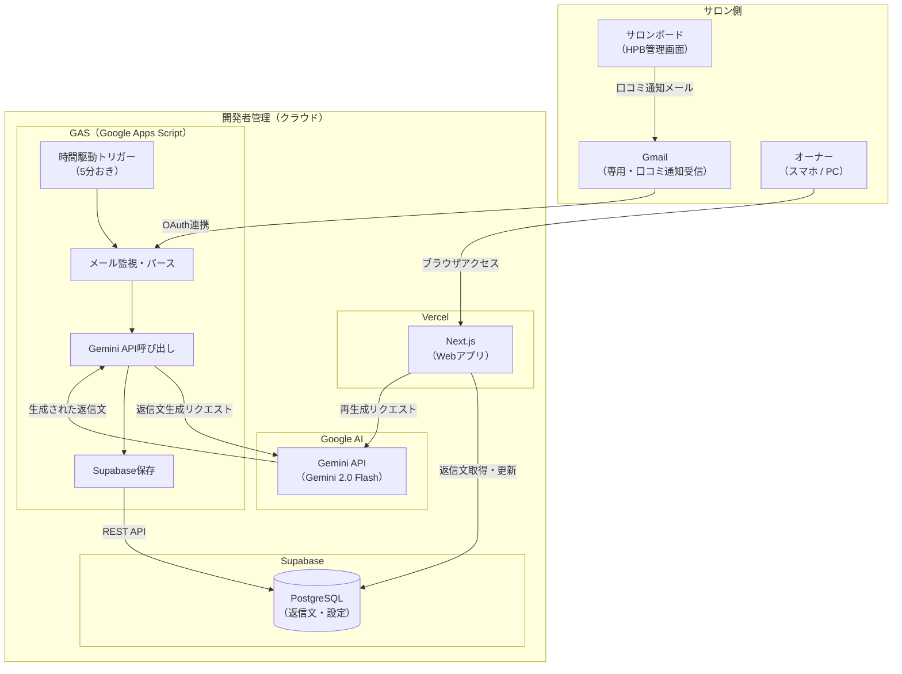
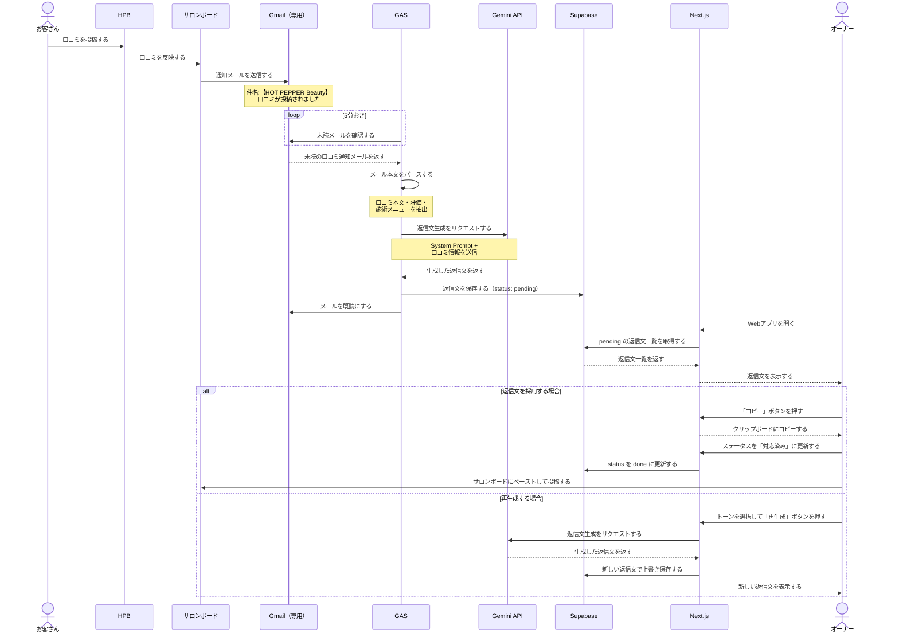
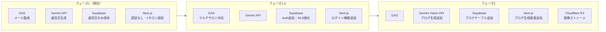

# アーキテクチャ図

## システム全体構成

```mermaid
graph TB
  subgraph salon["サロン側"]
    SB["サロンボード\n（HPB管理画面）"]
    GM["Gmail\n（専用・口コミ通知受信）"]
    OW["オーナー\n（スマホ / PC）"]
  end

  subgraph cloud["開発者管理（クラウド）"]
    subgraph gas["GAS（Google Apps Script）"]
      TR["時間駆動トリガー\n（5分おき）"]
      ML["メール監視・パース"]
      GN["Gemini API呼び出し"]
      SV["Supabase保存"]
    end

    subgraph gemini["Google AI"]
      GEM["Gemini API\n（Gemini 2.0 Flash）"]
    end

    subgraph vercel["Vercel"]
      NX["Next.js\n（Webアプリ）"]
    end

    subgraph supabase["Supabase"]
      DB[("PostgreSQL\n（返信文・設定）")]
    end
  end

  SB -->|"口コミ通知メール"| GM
  GM -->|"OAuth連携"| ML
  TR --> ML
  ML --> GN
  GN -->|"返信文生成リクエスト"| GEM
  GEM -->|"生成された返信文"| GN
  GN --> SV
  SV -->|"REST API"| DB
  OW -->|"ブラウザアクセス"| NX
  NX -->|"返信文取得・更新"| DB
  NX -->|"再生成リクエスト"| GEM
```

## 口コミ返信のシーケンス図

```mermaid
sequenceDiagram
  actor Customer as お客さん
  participant HPB as HPB
  participant SB as サロンボード
  participant Gmail as Gmail（専用）
  participant GAS as GAS
  participant Gemini as Gemini API
  participant DB as Supabase
  participant Web as Next.js
  actor Owner as オーナー

  Customer->>HPB: 口コミを投稿する
  HPB->>SB: 口コミを反映する
  SB->>Gmail: 通知メールを送信する
  Note over Gmail: 件名:【HOT PEPPER Beauty】<br/>口コミが投稿されました

  loop 5分おき
    GAS->>Gmail: 未読メールを確認する
  end

  Gmail-->>GAS: 未読の口コミ通知メールを返す
  GAS->>GAS: メール本文をパースする
  Note over GAS: 口コミ本文・評価・<br/>施術メニューを抽出

  GAS->>Gemini: 返信文生成をリクエストする
  Note over GAS,Gemini: System Prompt +<br/>口コミ情報を送信
  Gemini-->>GAS: 生成した返信文を返す

  GAS->>DB: 返信文を保存する（status: pending）
  GAS->>Gmail: メールを既読にする

  Owner->>Web: Webアプリを開く
  Web->>DB: pending の返信文一覧を取得する
  DB-->>Web: 返信文一覧を返す
  Web-->>Owner: 返信文を表示する

  alt 返信文を採用する場合
    Owner->>Web: 「コピー」ボタンを押す
    Web-->>Owner: クリップボードにコピーする
    Owner->>Web: ステータスを「対応済み」に更新する
    Web->>DB: status を done に更新する
    Owner->>SB: サロンボードにペーストして投稿する
  else 再生成する場合
    Owner->>Web: トーンを選択して「再生成」ボタンを押す
    Web->>Gemini: 返信文生成をリクエストする
    Gemini-->>Web: 生成した返信文を返す
    Web->>DB: 新しい返信文で上書き保存する
    Web-->>Owner: 新しい返信文を表示する
  end
```

## フェーズ別の構成変化

```mermaid
graph LR
  subgraph ph1["フェーズ1（現在）"]
    A1["GAS\nメール監視"]
    A2["Gemini API\n返信文生成"]
    A3["Supabase\n返信文のみ保存"]
    A4["Next.js\n認証なし・1サロン固定"]
  end

  subgraph ph15["フェーズ1.5"]
    B1["GAS\nマルチサロン対応"]
    B2["Gemini API"]
    B3["Supabase\nAuth追加・RLS強化"]
    B4["Next.js\nログイン機能追加"]
  end

  subgraph ph2["フェーズ2"]
    C1["GAS"]
    C2["Gemini Vision API\nブログ生成追加"]
    C3["Supabase\nブログテーブル追加"]
    C4["Next.js\nブログ生成画面追加"]
    C5["Cloudflare R2\n画像ストレージ"]
  end

  ph1 --> ph15 --> ph2
```
