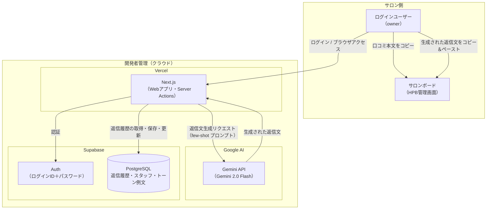
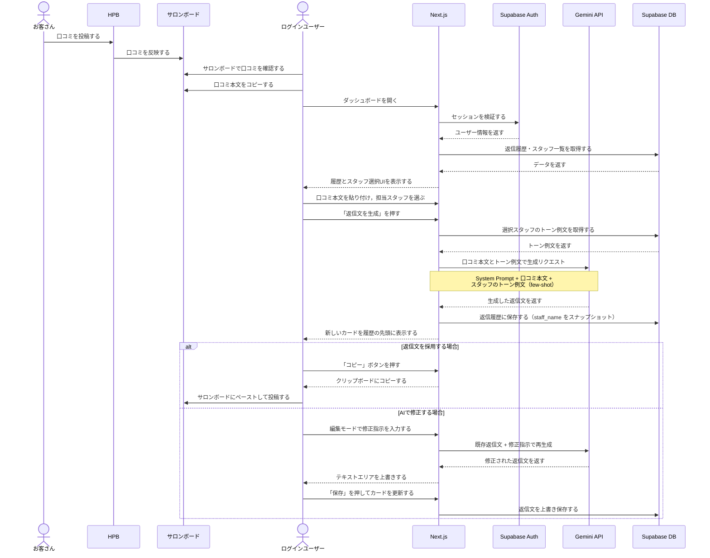
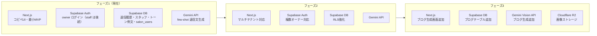

# アーキテクチャ図

## システム全体構成

```mermaid
graph TB
  subgraph salon["サロン側"]
    SB["サロンボード\n（HPB管理画面）"]
    US["ログインユーザー\n（owner）"]
  end

  subgraph cloud["開発者管理（クラウド）"]
    subgraph gemini["Google AI"]
      GEM["Gemini API\n（Gemini 2.0 Flash）"]
    end

    subgraph vercel["Vercel"]
      NX["Next.js\n（Webアプリ・Server Actions）"]
    end

    subgraph supabase["Supabase"]
      AU["Auth\n（ログインID＋パスワード）"]
      DB[("PostgreSQL\n返信履歴・スタッフ・トーン例文")]
    end
  end

  US -->|"口コミ本文をコピー"| SB
  US -->|"ログイン / ブラウザアクセス"| NX
  NX -->|"認証"| AU
  NX -->|"返信文生成リクエスト\n（few-shot プロンプト）"| GEM
  GEM -->|"生成された返信文"| NX
  NX -->|"返信履歴の取得・保存・更新"| DB
  US -->|"生成された返信文をコピー＆ペースト"| SB
```

## 口コミ返信のシーケンス図

```mermaid
sequenceDiagram
  actor Customer as お客さん
  participant HPB as HPB
  participant SB as サロンボード
  actor User as ログインユーザー
  participant Web as Next.js
  participant Auth as Supabase Auth
  participant Gemini as Gemini API
  participant DB as Supabase DB

  Customer->>HPB: 口コミを投稿する
  HPB->>SB: 口コミを反映する

  User->>SB: サロンボードで口コミを確認する
  User->>SB: 口コミ本文をコピーする

  User->>Web: ダッシュボードを開く
  Web->>Auth: セッションを検証する
  Auth-->>Web: ユーザー情報を返す
  Web->>DB: 返信履歴・スタッフ一覧を取得する
  DB-->>Web: データを返す
  Web-->>User: 履歴とスタッフ選択UIを表示する

  User->>Web: 口コミ本文を貼り付け，担当スタッフを選ぶ
  User->>Web: 「返信文を生成」を押す

  Web->>DB: 選択スタッフのトーン例文を取得する
  DB-->>Web: トーン例文を返す
  Web->>Gemini: 口コミ本文とトーン例文で生成リクエスト
  Note over Web,Gemini: System Prompt + 口コミ本文 +<br/>スタッフのトーン例文（few-shot）
  Gemini-->>Web: 生成した返信文を返す
  Web->>DB: 返信履歴に保存する（staff_name をスナップショット）
  Web-->>User: 新しいカードを履歴の先頭に表示する

  alt 返信文を採用する場合
    User->>Web: 「コピー」ボタンを押す
    Web-->>User: クリップボードにコピーする
    User->>SB: サロンボードにペーストして投稿する
  else AIで修正する場合
    User->>Web: 編集モードで修正指示を入力する
    Web->>Gemini: 既存返信文 + 修正指示で再生成
    Gemini-->>Web: 修正された返信文を返す
    Web-->>User: テキストエリアを上書きする
    User->>Web: 「保存」を押してカードを更新する
    Web->>DB: 返信文を上書き保存する
  end
```

## フェーズ別の構成変化

```mermaid
graph LR
  subgraph ph1["フェーズ1（現在）"]
    A1["Next.js\nコピペUI・最小MVP"]
    A2["Supabase Auth\nowner ログイン（staff は後続）"]
    A3["Supabase DB\n返信履歴・スタッフ・トーン例文・salon_users"]
    A4["Gemini API\nfew-shot 返信文生成"]
  end

  subgraph ph2["フェーズ2"]
    B1["Next.js\nマルチテナント対応"]
    B2["Supabase Auth\n複数オーナー対応"]
    B3["Supabase DB\nRLS強化"]
    B4["Gemini API"]
  end

  subgraph ph3["フェーズ3"]
    C1["Next.js\nブログ生成画面追加"]
    C2["Supabase DB\nブログテーブル追加"]
    C3["Gemini Vision API\nブログ生成追加"]
    C4["Cloudflare R2\n画像ストレージ"]
  end

  ph1 --> ph2 --> ph3
```
